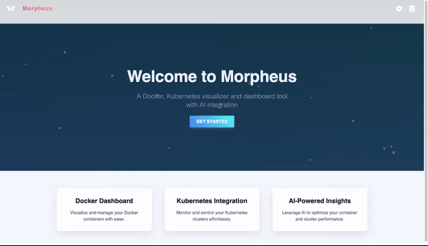

---

<a name="website" href="">Website</a>
<a name="medium" href="">Medium</a>
<a name="linkedin" href="">LinkedIn</a>

# Morpheus

Welcome to Morpheus, a developer-friendly Docker & Kubernetes application to visualize both container and cluster metrics.

## Getting Started

Go ahead and open up the [README-DEVELOPER](https://github.com/oslabs-beta/Morpheus/blob/dev/DEV_README.md) file to get started.

### What's in Version 1.0.0?

| Feature                                                      | Status |
| ------------------------------------------------------------ | ------ |
| Ability to view Docker container metrics                     | ✅     |
| Ability to visualize Kubernetes environment                  | ✅     |
| Ability to query AI for Docker environment optimizations     | ✅     |
| Ability to query AI for Kubernetes environment optimizations | ✅     |
| Ability to start and stop individual Docker containers       | ✅     |
| Ability to save Docker metrics for comparisons over time     | ✅     |
| Ability to change color theme of web application             | ✅     |
| Consistent styles between pages for optimal user experience  | ✅     |

- ✅ = Ready to use
   

## Contributing

Contributions play a vital role in the open-source community. Any contributions are greatly appreciated!

- Fork the project.
- Create and work off of your feature branch.
- Create a pull request with a detailed description of your changes from your feature branch to dev branch.
- Please let us know when PR submission is done. Once the changes are reviewed and approved, we will merge your code into the main repository.

## Our Team

- Brian Nguyen [GitHub](https://github.com/BrianNguyen2323) | [LinkedIn](https://www.linkedin.com/in/ngynbrian/)
- Darius Teng [GitHub](https://github.com/dariusteng) | [LinkedIn]()
- Jasen Tenney [GitHub](https://github.com/jntenney) | [LinkedIn](https://www.linkedin.com/in/jasentenney/)
- Kai Jiang [GitHub](https://github.com/kaij6) | [LinkedIn](https://www.linkedin.com/in/kai-jiang-9545a3295/)
- Santiago Cravino [GitHub](https://github.com/cravinos) | [LinkedIn](https://www.linkedin.com/in/santiago-cravino/)

## Show Your Support

Please ⭐️ this project if you found it helpful, thank you!
 

